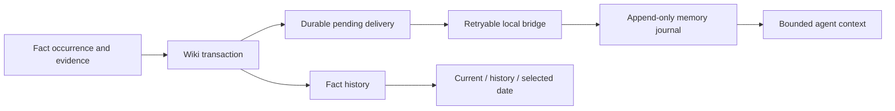

# Memory Ledger

[Русский](README.ru.md) · English

A local, append-only memory journal and fact-history layer for AI agents.
Keep **what was said**, **which fact is current**, and **why a fact stopped being current** separate.
Extracted from MemPalace additions and the author's LLM Wiki application.

A value can change **A → B → A**. The second A is a new occurrence with its own evidence.
Rejecting that latest occurrence restores the exact predecessor. Retracting it does not.

## Try it

Requires **Node.js 24+**. The parity tests also require **Python 3.10+** with SQLite FTS5.
No npm packages, model, vector database, API key, or MemPalace installation is needed for the demo.
Node's built-in SQLite API is still experimental in the tested Node 24.11.1 release.

```sh
npm run demo
npm test
```

The demo creates two temporary databases using synthetic facts.
It prints the current value, the value on a selected date, the source history, and a conflict rollback.
It never reads your working memory. The test suite contains 62 passing tests on the tested host.

## What you can reuse

| Component | Purpose |
| --- | --- |
| `scripts/memory_contract.js` | Immutable event identities, append-only SQLite journal, text search, supplied-vector search, bounded context packs and retrieval traces |
| `wiki/fact-lineage.mjs` | Evidence-linked occurrences, current/history/date reads, conflict and retraction semantics, transactional migrations |
| Wiki's durable outbox | Retry transfer to the shared journal after a bridge outage; preserve the producer's event identity |
| `python/event_store.py` | Matching event and embedding contract for Python consumers |
| Hermes bridge and plugin | Profile/topic-isolated reads and exact, session-bound approval before a proposed memory write |

The demo uses a real SQLite bridge. Tests cover retries, duplicate delivery, out-of-order facts,
A → B → A changes, transaction rollback, scoped access, expired approvals and concurrent confirmation.
Vectors are supplied by the caller. This package does not call an embedding service.



## Integration boundaries

Always pass an explicit `dbPath` to journal calls, or set `MEMORY_EVENTS_DB_PATH`.
Otherwise the inherited default is `~/.mempalace/memory_events.sqlite3`.
The demo sets a temporary path. Copy a database before trying a migration on existing data.

Wiki bridge discovery uses this repository's journal module.
`MEMORY_CONTRACT_MODULE` can point to another compatible module.
Call `flushFactMemoryOutbox()` again after a failed delivery; the package does not start a background worker.
The minimal policy in `config/memory-policy.json` contains bounded recall settings and local objective operations.
It has no workspace model routing or machine-specific configuration.

The optional Hermes plugin requires a compatible Hermes gateway with `gateway.session_context`.
It is an integration example, with synthetic gateway tests; a live Hermes installation has not been verified here.
See [the integration guide](docs/hermes.md). Its model-facing tools can read or propose a write.
Only the exact private `/memory-confirm ID HASH` command can commit that proposal.

## Limits and privacy

This is a reusable correctness layer, not a complete chat app or a claim of novel memory architecture.
It does not extract facts with an LLM, resolve conflicting evidence automatically, or verify truth.
A caller must supply a validated lineage key before values can supersede one another.
Date queries follow supplied fact timestamps. They do not prove when a statement was true in the real world.

Common credential formats are redacted before capture. This is **not anonymization**.
Facts, source references and chat identifiers can still be personal data.
Do not publish runtime databases, real Hermes routes, session context, trace keys or personal source material.
Query previews require explicit opt-in. Optional Wiki telemetry stores a local salt; it does not send data anywhere.
The Python Chroma projection helper additionally requires Chroma; the demo and tests do not use it.

See [setup, backup, restore, export and upgrade instructions](docs/operations.md).

## Origin and license

[MemPalace](https://github.com/MemPalace/mempalace) is the upstream memory project that these additions were built around.
The fact-history module comes from the author's own LLM Wiki application.
This repository contains the extracted additions and synthetic examples, not a complete MemPalace fork or Wiki UI.

[MIT License](LICENSE). See [NOTICE](NOTICE) for provenance and extraction changes.
[Release checklist](docs/release-checklist.md).
