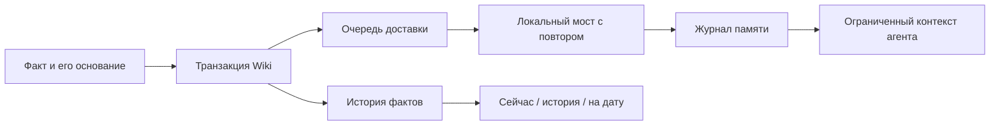

# Memory Ledger

Русский · [English](README.md)

Локальный журнал памяти и история фактов для ИИ-агентов.
Код разделяет **что было сказано**, **какой факт действует сейчас** и **почему прежний факт перестал действовать**.
Выделен из надстроек MemPalace и авторского приложения LLM Wiki.

Значение может измениться **A → B → A**. Второе A — отдельное событие со своим источником.
Признание последнего события конфликтным возвращает точного предшественника. Отзыв факта этого не делает.

## Попробовать

Нужен **Node.js 24+**. Для проверки совместимости с Python нужен **Python 3.10+** с SQLite FTS5.
Демонстрация не требует npm-пакетов, модели, векторной базы, ключа API или установленного MemPalace.
В проверенном Node 24.11.1 встроенный интерфейс SQLite ещё имеет статус экспериментального.

```sh
npm run demo
npm test
```

Демонстрация создаёт две временные базы с вымышленными фактами.
Она показывает текущее значение, значение на выбранную дату, историю источников и откат конфликта.
Она не читает рабочую память. На проверенном компьютере прошли все 62 теста.

## Что можно использовать

| Компонент | Назначение |
| --- | --- |
| `scripts/memory_contract.js` | Неизменяемые идентификаторы событий, журнал SQLite, текстовый поиск, поиск по переданным векторам, ограниченные пакеты контекста и журнал поиска |
| `wiki/fact-lineage.mjs` | События со ссылками на основания, чтение текущего состояния и истории, состояние на дату, конфликты, отзыв и транзакционные миграции |
| Очередь доставки Wiki | Повтор доставки в общий журнал после сбоя с сохранением исходного идентификатора события |
| `python/event_store.py` | Тот же контракт событий и векторов для Python |
| Мост и плагин Hermes | Чтение в границах профиля и темы; точное подтверждение записи, привязанное к сессии |

Демонстрация использует настоящий мост между базами SQLite.
Тесты проверяют повторную доставку, дубликаты, события не по порядку, A → B → A,
откат транзакций, границы доступа, просроченные предложения и одновременное подтверждение.
Векторы передаёт вызывающий код. Пакет не обращается к сервису эмбеддингов — числовых представлений текста.



## Подключение

Передавай явный `dbPath` в вызовы журнала или задай `MEMORY_EVENTS_DB_PATH`.
Унаследованный путь по умолчанию — `~/.mempalace/memory_events.sqlite3`.
Демонстрация использует временный путь. Перед миграцией существующей базы сделай её копию.

Мост Wiki находит модуль журнала этого репозитория.
Переменная `MEMORY_CONTRACT_MODULE` позволяет выбрать другой совместимый модуль.
После неудачной доставки повторно вызови `flushFactMemoryOutbox()`.
Пакет не запускает фоновый процесс.
Минимальная политика `config/memory-policy.json` задаёт пределы поиска и локальные операции с целями.
Она не содержит выбора моделей и настроек рабочих компьютеров.

Необязательный плагин Hermes требует совместимый шлюз с `gateway.session_context`.
Это пример интеграции с тестовым шлюзом. Реальная установка Hermes здесь не проверена.
См. [инструкцию подключения](docs/hermes.md).
Инструменты модели могут читать память или предлагать запись.
Запись подтверждает только точная команда `/memory-confirm ID HASH` в личном чате.

## Ограничения и приватность

Это слой правил хранения, а не готовое приложение для чата или заявление о новой архитектуре памяти.
Пакет не извлекает факты с помощью модели, не разрешает противоречия автоматически и не проверяет истинность.
Для замены значений вызывающий код должен передать проверенный ключ цепочки фактов.
Запрос на дату использует переданные отметки времени. Он не доказывает, когда утверждение было верным в реальном мире.

Перед записью код удаляет несколько распространённых форматов ключей и токенов.
Это **не обезличивание**. Факты, ссылки на источники и идентификаторы чатов могут содержать личные данные.
Не публикуй рабочие базы, реальные маршруты Hermes, контекст сессий, ключи журнала поиска и личные источники.
Сохранение текста поискового запроса требует явного включения.
Необязательная статистика Wiki хранит локальную случайную соль для хеширования и ничего не отправляет.
Python-функция проекции в Chroma требует дополнительной установки Chroma. Демонстрация и тесты её не используют.

## Происхождение и лицензия

[MemPalace](https://github.com/MemPalace/mempalace) — исходный проект памяти, вокруг которого появились эти надстройки.
История фактов выделена из авторского приложения LLM Wiki.
Здесь находятся надстройки и вымышленные примеры. Полный MemPalace и интерфейс Wiki в пакет не входят.

[Лицензия MIT](LICENSE). Происхождение и изменения при выделении — в [NOTICE](NOTICE).
[Список работ перед стабильным выпуском](docs/release-checklist.md).
